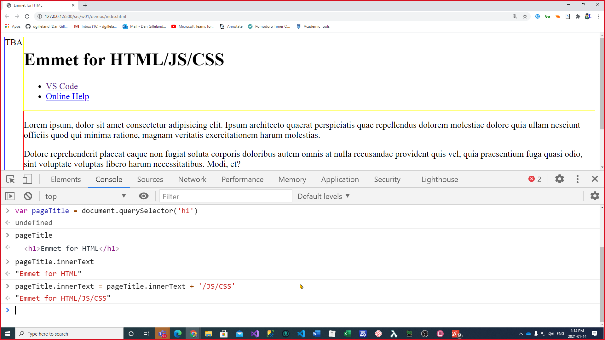

# Week 1 - Lesson Plan 

> Review the [**LOGs**](./LOGs.md) for this class.

----

## Days 1 & 2

<!-- This first class is an introduction and setup class -->

- **Intro to the Course**
  - [ ] Introduce the course outline, syllabus, and planning calendar
  - [ ] Outline classroom etiquette and what is expected from students regarding attendance, homework, and effort
  - [ ] Briefly review the required text resource online at http://eloquentjavascript.net/index.html
  - [ ] Install [Required Software](../../ReadMe.md)
    - [git](https://git-scm.com/downloads)
    - [Visual Studio **Code**](https://code.visualstudio.com)
    - Some kind of screen-shot program (e.g.: Jing)

      

- **Introduction to git and GitHub**
  - [ ] Discuss git and version control
  - [ ] Setup student GitHub accounts
  - [ ] Setup student workbooks
  - [ ] Basics of MarkDown
    - Direct students' attention to the docs and [My Notes](../../docs/mynotes/ReadMe.md) portion of the workbook
    - Edit the [**ReadMe.md**](../../ReadMe.md) file at the root of your workbook
    - Create a [ReadMe.md](./demos/ReadMe.md) file and add an image (screenshot of [QR Code for their name](https://www.the-qrcode-generator.com/))
  - [ ] Committing Changes and Synchronizing (pull/push) with GitHub
- **Basics of JavaScript Execution**
  - [ ] [JavaScript Spec (ES5 vs ES6 vs ES7)](https://developer.mozilla.org/en-US/docs/Web/JavaScript/Language_Resources) and [Implementations (Chakra for *Opera* vs Spider Monkey for *FireFox* vs V8 for *Chrome*)](https://developer.mozilla.org/en-US/docs/Web/JavaScript/Language_Resources#Implementations)
    - JavaScript is
      - Case Sensitive
      - *not* a Type-Safe language (like C#)
  - [ ] Browsers and JavaScript Engines
    - How the browser parses pages and scripts
    - Interpreted vs compiled programming languages
      - Compiled programs tend to run faster, but are specific to the OS/hardware it is run on
      - Interpreted languages are a bit slower, but don't have to worry about the OS/hardware, because it runs in a "context" (the browser) that interprets the code

## Day 3

<!-- Demo the effect of a pull and the need for synchronizing by adding a commit to each student's repository  -->
<!-- JavaScript editing in the Browser + First assignment -->

- **Review/Questions**
  - [ ] Answer student questions and review from previous class
- **Basic Console Access**
  - [ ] How to open the developer tools console
  - [ ] How to execute simple JS statements in the console
- **Basic DOM access**
  - [ ] Demonstrate basic DOM selector methods
  - [ ] Demonstrate how to use the innerHTML property of HTMLElement objects
- **Basic Variable Declaration and Assignment**
  - [ ] Simple variable declarations
  - [ ] Simple types (strings and numbers)
- **In-Class Assessment**
  - [ ] Have students work through the console exercise (not for marks) and in-class assessment (for marks), which **must be completed by the end of class** <!--(only release the in-class assessment in class on this day via GitHub Classroom Assignment; DO NOT release through Moodle).-->
